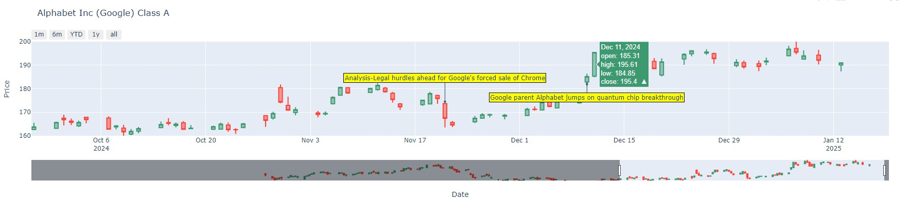

## InvestorWatch

Correlates price movement with news articles from high quality publishers (Bloomberg, Reuters) in attempt to find 'catalysts' or reasons for drastic price changes in a stock. News from stocks in the S&P 500 are mined + enriched daily. 

- Can assist retail investors in 'due diligence'; generating a news timeline for a specific stock one would be interested about, or just staying informed about recent events.

---

---

#### Libraries used:
- yFinance (Yahoo Finance API) 
- NLTK (for tokenization and filtering) and TextBlob
- pandas
- Matplotlib/plotly
- finvizfinance
  
---

#### Future plans
- visualization in tableau

