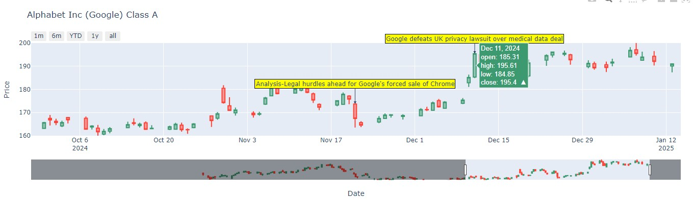

## InvestorWatch

Utilizes sentiment analysis with NLP libraries to determine market sentiment about some stock / economic event. This can help in market price prediction as it gives the general prevailing attitude of investors as to anticipated price development in the market.
- If investors expect upward price movement in the stock market, the sentiment is said to be **bullish**.
- On the contrary, if the market sentiment is **bearish**, most investors expect downward price movement.

---

---

### How it works
This project scrapes news headlines (Yahoo Finance) and Reddit to get social media reactions about a certain stock, and then uses NLP to analyze them to determine the sentiment. 

Results are then indexed in Elasticsearch for quick lookup of the market sentiment for certain events, and to visualize a stock's price, along with its sentiment.

Example: As of __1/15/2024__ there is a lot of negative news surrounding Boeing (NYSE: BA) following an incident due to a lack of QC. Market sentiment is bearish, and the past month the stock has sold off -17%. Conversely, its rival Airbus SE saw a uptick of +6.4%

--->

---

#### Libraries used:
- yFinance (Yahoo Finance API) 
- NLTK (for tokenization and filtering) and TextBlob
- pandas
- Matplotlib/plotly
  
---

